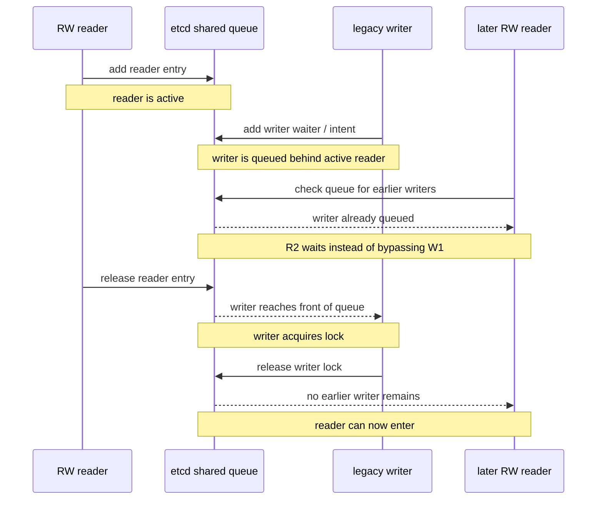

# etcd-lock v5.0.11

## Import

```
# Master via standard import
go get github.com/Scalingo/go-etcd-lock

# Last stable is v0 via gopkg.in
go get gopkg.in/Scalingo/go-etcd-lock.v3vendor/github.com/Scalingo/go-etcd-lock/lock/lock
```

## Example

```go
l, err := lock.Acquire(client, "/name", 60)
if lockErr, ok := err.(*lock.Error); ok {
  // Key already locked
  fmt.Println(lockErr)
  return
} else if err != nil {
  // Communication with etcd has failed or other error
  panic(err)
}

// It's ok, lock is granted for 60 secondes

// When the opration is done we release the lock
err = l.Release()
if err != nil {
  // Something wrong can happen during release: connection problem with etcd
  panic(err)
}
```

## Reader / Writer Lock

Use `NewEtcdRWLocker` when you want shared readers and exclusive writers without changing the existing lock behavior. RW readers participate in the same etcd queue prefix as legacy write locks, so legacy locks and RW locks honor each other during a rollout.

During a migration from `go-etcd-lock` `v5.0.9` to `v6.*` you can safely run both implementations against the same lock key. Existing `EtcdLocker` locks remain write locks, `EtcdRWLocker.AcquireWrite` uses the same write-lock mechanism, and `EtcdRWLocker.AcquireRead` joins the same etcd queue with reader-specific entries. That means legacy writers wait for active RW readers, and new RW readers will not bypass older legacy writers already queued on the lock.



```go
locker := lock.NewEtcdRWLocker(client)

readLock, err := locker.AcquireRead("/name", 60)
if err != nil {
	panic(err)
}
defer readLock.Release()
```

```go
writeLock, err := locker.WaitAcquireWrite("/name", 60)
if err != nil {
	panic(err)
}
defer writeLock.Release()
```

## Testing

You need a etcd instance running on `localhost:2379`, then:

```
go test ./...
```

## Generate mock

From the `/lock/` folder:

```
mockgen -build_flags=--mod=mod -destination lockmock/locker_mock.go -package lockmock github.com/Scalingo/go-etcd-lock/v5/lock Locker
mockgen -build_flags=--mod=mod -destination lockmock/gomock_rw_locker.go -package lockmock github.com/Scalingo/go-etcd-lock/v5/lock RWLocker
mockgen -build_flags=--mod=mod -destination lockmock/lock_mock.go -package lockmock github.com/Scalingo/go-etcd-lock/v5/lock Lock
```
## Release a New Version

Bump new version number in:
- `CHANGELOG.md`
- `README.md`
- `go.mod`, `mocks.json` and all imports in case of a new major version

Commit, tag and create a new release:

```sh
version="5.0.11"

git switch --create release/${version}
git add CHANGELOG.md README.md
git commit --message="Bump v${version}"
git push --set-upstream origin release/${version}
gh pr create --reviewer=Scalingo/team-ist --title "$(git log -1 --pretty=%B)"
```

Once the pull request merged, you can tag the new release.

```sh
git tag v${version}
git push origin master v${version}
gh release create v${version}
```

The title of the release should be the version number and the text of the release is the same as the changelog.
